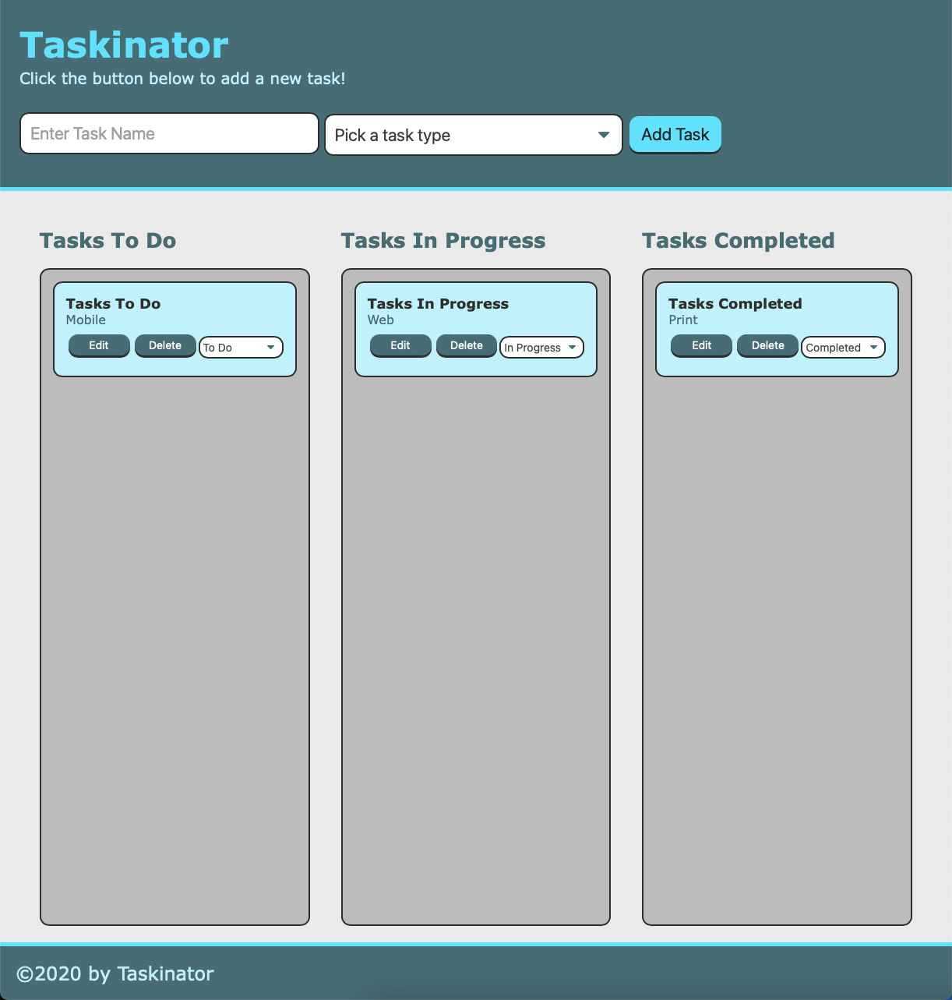

# Taskinator

## Description
A task list organizer to make betetr organize your projects in order from tasks to do, tasks in progress and tasks completed.
## Installation

Clone the repository locally and double click `index.html` or click on the link below in the usage section

## Usage

Screenshot of website

To visit please click on link [link](https://vsoto7697.github.io/Taskinator/)

## Challenges
One thing I had trouble on was setting my variables, I tried classifying each variable but I kept recieving an error message after prompts were selected. I also struggled with deploying my url and using the functionality of pushing and pulling to and from github. I believe that my biggest challenge was programming the conditional statement that links function that determined the user's password based on their input; I wasn't able to properly link each statement to the variable and kept getting a syntax error on my console. 

## License

Copyright (c) 2022 Victor Soto